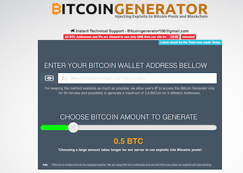
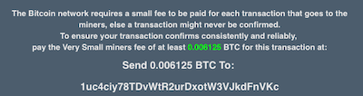

**Fake?**

What the hell are these sites? If you have any experience with any of these, please comment:

<a href="http://xbtc100.com/" target="_blank">Bitcoin Generator</a> claims to generate 1-5 BTC within minutes and send them to your wallet. But, before they send YOU money, they're asking you to pay THEM the "miners fee". We suggest you never send them anything.

<table>
<tbody>
<tr>
<td style="width: 400px;"></td>
<td style="width: 400px;"></td>
</tr>
</tbody>
</table>

 

